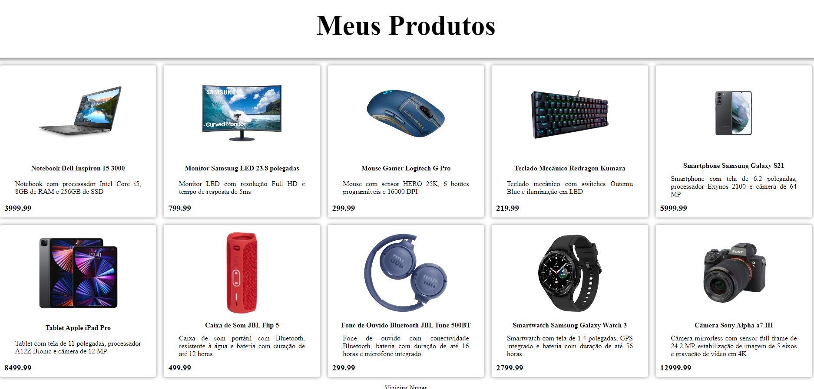

# **CARD PRODUTOS**

## [Clique aqui](#) para acessar o site

## **SOBRE**

- Criação de cards com base nas informações obtidas por um JSON

## **TECNOLOGIAS APLICADAS**

- HTML5
- CSS3
- JS

## **FERRAMENTAS**

- VSCODE
- GITHUB / GIT

## **CONCEITOS APLICADOS**

- IMPORTS
- MAP
- TYPE MODULE

## **AUTOR**

- [VINICIUS NUNES](https://github.com/VINICIUSNUNES137)

